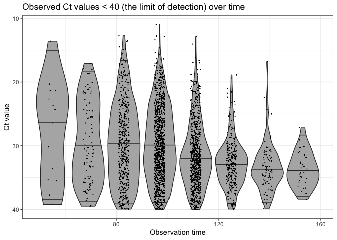
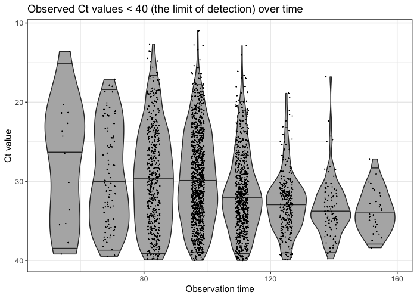
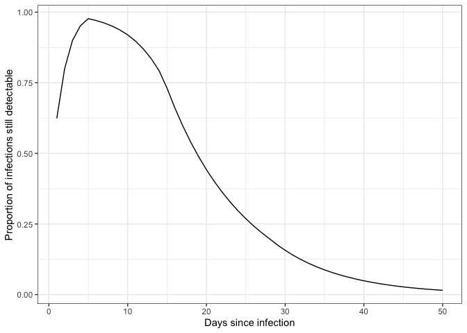

[](https://zenodo.org/badge/latestdoi/301812162)
[](https://www.tidyverse.org/lifecycle/#maturing)

# A method to infer epidemic dynamics using viral load data: virosolver

This README provides instructions for setup and installation of the
`virosolver` package. A vignette is provided with a simple case study
using simulated data to re-estimate the true underlying incidence curve.

Documentation for this package is a work in progress, but all code is
working correctly. This particular version accompanies the git
repository at <https://github.com/jameshay218/virosolver_paper>, where
use cases and instructions are provided.

# Setup

This package relies on the `lazymcmc` R package, which is used for the
MCMC procedure. This is easy to do with
`devtools::install_github("jameshay218/lazymcmc")`. *However*, for many
analyses where multi-modal posteriors are suspected, a separate branch
implementing parallel tempering is needed. I’d recommend you set this up
as follows: - Install the `lazymcmc` base package using
`devtools::install_github` as above. Any time this version is used,
`library(lazymcmc)` is called. - Clone the `parallel_tempering` branch
from
[here](https://github.com/jameshay218/lazymcmc/tree/parallel_tempering).
Whenever this version is needed, then `devtools::load_all("PATH TO
LAZYMCMC PARALLEL TEMPERING REPO")` is called instead.

It is possible to install the parallel tempering branch directly with
`devtools::load_all("jameshay218/lazymcmc",ref="parallel_tempering")`,
but I prefer to load the package locally until I merge the parallel
tempering and master branches.

A number of generic R packages are also used throughout:

``` r
c("tidyverse","ggthemes","ggpubr","ggsci","data.table","patchwork",
"fitdistrplus","deSolve","lazymcmc","odin","doParallel","coda")
```

Finally, this code uses compiled code with Rcpp, so you’ll need a C++
compiler (Rtools on Windows, Xcode on Mac). See
[here](http://adv-r.had.co.nz/Rcpp.html).

# Case study vignette - simulated data

``` r
library(virosolver)
library(tidyverse)
```

    ## ── Attaching packages ─────────────────────────────────────── tidyverse 1.3.0 ──

    ## ✓ ggplot2 3.3.2     ✓ purrr   0.3.4
    ## ✓ tibble  3.0.3     ✓ dplyr   1.0.2
    ## ✓ tidyr   1.1.2     ✓ stringr 1.4.0
    ## ✓ readr   1.3.1     ✓ forcats 0.5.0

    ## ── Conflicts ────────────────────────────────────────── tidyverse_conflicts() ──
    ## x dplyr::filter() masks stats::filter()
    ## x dplyr::lag()    masks stats::lag()

## Rationale

`virosolver` takes an input data frame of Ct values with associated
sample collection dates from quantitative reverse transcription PCR
(RT-qPCR) testing, and reconstructs the incidence curve that gave rise
to those measurements. The logic is as follows:

  - There is an unobserved incidence curve that describes the generation
    of new infections over time;
  - Susceptible individuals may become infected at some point in time
    with probability equal to the per-capita incidence on each day;
  - Following infection, viral loads in the infected individual follow
    some set of predictable kinetics (ie. viral loads go up then down);
  - Individuals are sampled at random from the population (a random
    cross-sectional sample), and thus an individual’s viral load is
    measured at some unknown point (as a Ct value) in their infection
    course;
  - If we mostly measure low viral loads, then most of the individuals
    we sampled were in the late stage of their infection and incidence
    was likely declining, but if we mostly measure high viral loads,
    then most individuals were early on in their infection course and
    incidence was likely growing.

By capturing this model in a mathematical model, we can obtain a
probabilistic estimate of the underlying incidence curve having observed
a set of Ct values at some point in time.

That was a bit of a whirlwind explanation – the key idea is that you can
estimate incidence based on cross-sections of observed Ct values. This
case study explores the application of `virosolver` to SARS-CoV-2. A
full explanation can be found in the accompanying
[paper](https://doi.org/10.1101/2020.10.08.20204222).

## Data

`virosolver` expects a data frame as input data in long format, where
each row corresponds to one tested sample. There should be one column
labeled as `t`, giving the time in days a sample was taken, and one
column labeled `ct`, giving the Ct value of that tested sample. Note
that Ct values are semi-quantitative and their scale depends on the
platform/instrument used. It is assumed that all Ct values within the
data frame are on the same scale and therefore internally consistent
across time points.

``` r
data(example_ct_data)
## Plot only detectable Ct values
p_ct_data <- ggplot(example_ct_data %>% filter(ct < 40)) + 
  geom_violin(aes(x=t,group=t,y=ct),scale="width",fill="grey70",draw_quantiles=c(0.025,0.5,0.975)) + 
  geom_jitter(aes(x=t,y=ct),size=0.1,width=2,height=0) + 
  scale_y_continuous(trans="reverse") +
  theme_bw() +
  ylab("Ct value") +
  xlab("Observation time") +
  ggtitle("Observed Ct values < 40 (the limit of detection) over time")
p_ct_data
```

<!-- -->

``` r
p_detectable_data <- example_ct_data %>% 
  mutate(detect=ct < 40) %>% 
  group_by(t) %>% 
  summarize(prev=sum(detect)/n()) %>% 
  ggplot() + geom_point(aes(x=t,y=prev)) + 
  theme_bw() + 
  scale_y_continuous(limits=c(0,0.5)) + 
  ylab("Percent detectable") +
  ggtitle("Proportion of samples with Ct values < 40") +
  xlab("Observation time") 
```

    ## `summarise()` ungrouping output (override with `.groups` argument)

``` r
p_detectable_data
```

<!-- -->

A script to generate these data can be found in the `extdata` folder,
which is easiest to find
[here](https://github.com/jameshay218/virosolver/tree/master/man/inst/extdata).

## Ct model

A key part of the model is the assumed viral kinetics curve. This
describes the mode and variation of Ct values on each day post
infection. This is the population-level distribution – it does not track
individual-level viral kinetics curve, so the variation about the mode
captures *all* variation arising from sampling variation,
individual-level heterogeneity etc. It is *CRUCIAL* to check the
parameters underpinning this model when applying `virosolver` to a new
dataset, as this calibration will be entirely dependent on the
population being tested and the PCR instrument used. We assume the
following Ct model for this simulation:

``` r
data(example_seir_partab)
pars <- example_seir_partab$values
names(pars) <- example_seir_partab$names

## Solve the Ct model over a range of times since infection (referred to as "ages")
test_ages <- seq(0,50,by=1)

## This gives the modal Ct value
cts <- viral_load_func(pars, test_ages)

p_ct_model <- ggplot(data.frame(ct=cts,t=test_ages)) + 
  geom_line(aes(x=t,y=ct)) + 
  scale_y_continuous(trans="reverse",
                     limits=c(40,0)) +
  theme_bw() +
  ylab("Modal Ct value") +
  xlab("Days since infection")
p_ct_model
```

<!-- -->

``` r
## Note that this model does not solve for t=0, as it is always assumed that no one is detectable 0 days post infection
prop_detect <- prop_detectable(test_ages[test_ages > 0],pars, cts[test_ages > 0])
p_ct_model_detectable <- ggplot(data.frame(p=c(0,prop_detect),t=test_ages)) + 
  geom_line(aes(x=t,y=p)) + 
  theme_bw() +
  ylab("Proportion of infections still detectable") +
  xlab("Days since infection")
p_ct_model_detectable
```

<!-- -->
