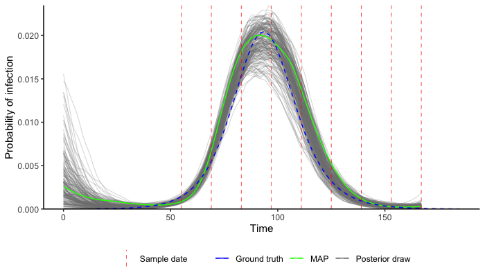

[](https://zenodo.org/badge/latestdoi/301812162)
[](https://www.tidyverse.org/lifecycle/#maturing)

# A method to infer epidemic dynamics using viral load data: virosolver

This README provides instructions for setup and installation of the
`virosolver` package. A vignette is provided with a simple case study
using simulated data to re-estimate the true underlying incidence curve.

Documentation for this package is a work in progress, but all code is
working correctly. This particular version accompanies the git
repository at <https://github.com/jameshay218/virosolver_paper>, where
use cases and instructions are provided.

# Setup

This package relies on the `lazymcmc` R package, which is used for the
MCMC procedure. This is easy to do with
`devtools::install_github("jameshay218/lazymcmc")`. *However*, for many
analyses where multi-modal posteriors are suspected, a separate branch
implementing parallel tempering is needed. I’d recommend you set this up
as follows: - Install the `lazymcmc` base package using
`devtools::install_github` as above. Any time this version is used,
`library(lazymcmc)` is called. - Clone the `parallel_tempering` branch
from
[here](https://github.com/jameshay218/lazymcmc/tree/parallel_tempering).
Whenever this version is needed, then `devtools::load_all("PATH TO
LAZYMCMC PARALLEL TEMPERING REPO")` is called instead.

It is possible to install the parallel tempering branch directly with
`devtools::load_all("jameshay218/lazymcmc",ref="parallel_tempering")`,
but I prefer to load the package locally until I merge the parallel
tempering and master branches.

A number of generic R packages are also used throughout:

``` r
c("tidyverse","ggthemes","ggpubr","ggsci","data.table","patchwork",
"fitdistrplus","deSolve","lazymcmc","odin","doParallel","coda")
```

Finally, this code uses compiled code with Rcpp, so you’ll need a C++
compiler (Rtools on Windows, Xcode on Mac). See
[here](http://adv-r.had.co.nz/Rcpp.html).

# Vignette - simulated data

``` r
library(virosolver)
library(tidyverse)
## ── Attaching packages ─────────────────────────────────────── tidyverse 1.3.0 ──
## ✓ ggplot2 3.3.2     ✓ purrr   0.3.4
## ✓ tibble  3.0.3     ✓ dplyr   1.0.2
## ✓ tidyr   1.1.2     ✓ stringr 1.4.0
## ✓ readr   1.3.1     ✓ forcats 0.5.0
## ── Conflicts ────────────────────────────────────────── tidyverse_conflicts() ──
## x dplyr::filter() masks stats::filter()
## x dplyr::lag()    masks stats::lag()
library(patchwork)
library(lazymcmc)
```

## 1\. Rationale

`virosolver` takes an input data frame of cycle threshold (Ct) values
with associated sample collection dates from quantitative reverse
transcription PCR (RT-qPCR) testing, and reconstructs the incidence
curve that gave rise to those measurements. The logic is as follows:

  - There is an unobserved incidence curve that describes the generation
    of new infections over time;
  - Susceptible individuals may become infected at some point in time
    with probability equal to the per-capita incidence on each day;
  - Following infection, viral loads in the infected individual follow
    some set of predictable kinetics (ie. viral loads go up then down);
  - Individuals are sampled at random from the population (a random
    cross-sectional sample), and thus an individual’s viral load is
    measured at some unknown point (as a Ct value) in their infection
    course;
  - If we mostly measure low viral loads, then most of the individuals
    we sampled were in the late stage of their infection and incidence
    was likely declining, but if we mostly measure high viral loads,
    then most individuals were early on in their infection course and
    incidence was likely growing.

By capturing this logic in a mathematical model, we can obtain a
probabilistic estimate of the underlying incidence curve having observed
a set of Ct values at some point in time.

To summarize, the key idea is that you can estimate incidence based on
cross-sections of observed Ct values. This case study explores the
application of `virosolver` to SARS-CoV-2 surveillance. A full
explanation can be found in the accompanying
[paper](https://doi.org/10.1101/2020.10.08.20204222).

## 2\. Data

`virosolver` expects a data frame as input data in long format, where
each row corresponds to one tested sample. There should be one column
labeled `t`, giving the time in days a sample was taken, and one column
labeled `ct`, giving the Ct value of that tested sample. Note that Ct
values are semi-quantitative and their scale depends on the
platform/instrument used. It is assumed that all Ct values within the
data frame are on the same scale and therefore internally consistent
across time points.

``` r
data(example_ct_data)
print(head(example_ct_data %>% filter(ct < 40)))
## # A tibble: 6 x 2
##       t    ct
##   <int> <dbl>
## 1    55  21.3
## 2    55  30.2
## 3    55  20.3
## 4    55  22.7
## 5    55  24.3
## 6    55  26.4
```

``` r
## Plot only detectable Ct values
p_ct_data <- ggplot(example_ct_data %>% filter(ct < 40)) + 
  geom_violin(aes(x=t,group=t,y=ct),scale="width",fill="grey70",draw_quantiles=c(0.025,0.5,0.975)) + 
  geom_jitter(aes(x=t,y=ct),size=0.1,width=2,height=0) + 
  scale_y_continuous(trans="reverse") +
  theme_bw() +
  ylab("Ct value") +
  xlab("Observation time") +
  ggtitle("Observed Ct values < 40 (the limit of detection) over time")
p_ct_data
```

<!-- -->

``` r
p_detectable_data <- example_ct_data %>% 
  mutate(detect=ct < 40) %>% 
  group_by(t) %>% 
  summarize(prev=sum(detect)/n()) %>% 
  ggplot() + geom_point(aes(x=t,y=prev)) + 
  theme_bw() + 
  scale_y_continuous(limits=c(0,0.5)) + 
  ylab("Proportion detectable") +
  ggtitle("Proportion of samples with Ct values < 40") +
  xlab("Observation time") 
## `summarise()` ungrouping output (override with `.groups` argument)
p_detectable_data
```

<!-- -->

A script to generate these data can be found in the `extdata` folder,
found
[here](https://github.com/jameshay218/virosolver/tree/master/man/inst/extdata).

## 3\. Ct model

A key part of the model is the assumed viral kinetics curve. This
describes the mode and variation of Ct values on each day post
infection. This is the population-level distribution – it does not track
individual-level viral kinetics curve, so the variation about the mode
captures *all* variation arising from sampling variation,
individual-level heterogeneity etc. It is *CRUCIAL* to understand the
parameters underpinning this model when applying `virosolver` to a new
dataset, as this calibration will be entirely dependent on the
population being tested and the PCR instrument used. Consider questions
like “what are the mean and range of Ct values I expect to see if I test
someone on my platform *x* days post infection?”, “what proportion of
positive samples taken *x* days post infection do I expect to test
positive?”.

We assume the following Ct model for this simulation:

``` r
data(example_gp_partab)
pars <- example_gp_partab$values
names(pars) <- example_gp_partab$names

## Solve the Ct model over a range of times since infection (referred to as "ages")
test_ages <- seq(1,50,by=1)

## This gives the modal Ct value
cts <- viral_load_func(pars, test_ages)

p_ct_model <- ggplot(data.frame(ct=c(40,cts),t=c(0,test_ages))) + 
  geom_line(aes(x=t,y=ct)) + 
  scale_y_continuous(trans="reverse",
                     limits=c(40,10)) +
  theme_bw() +
  ylab("Modal Ct value") +
  xlab("Days since infection")

## Note that this model does not solve for t=0, 
## as it is always assumed that no one is detectable 0 days post infection
prop_detect <- prop_detectable(test_ages,pars, cts)
p_ct_model_detectable <- ggplot(data.frame(p=c(0,prop_detect),t=c(0,test_ages))) + 
  geom_line(aes(x=t,y=p)) + 
  theme_bw() +
  ylab("Proportion of infections\n still detectable") +
  xlab("Days since infection")
p_ct_model/p_ct_model_detectable
```

<!-- -->

An intuitive way to look at this curve is to simulate observations from
it and plot the simulated Ct values ordered by days since infection.
From this, we can see the substantial amount of variation in
measurements on each day post infection, but also that there is still
some information in the Ct values. Note also that under this model,
individuals become truly undetectable (ie. fully recovered) following
some daily Bernoulli process. Those who remain detectable for a long
time demonstrate a “narrowing” of observed Ct values, where the
variation about the mode decreases. This model captures the observation
that few individuals remain detectable for a long time, but for those
who do, they do not necessarily have Ct values that tend towards the
limit of detection.

``` r
sim_cts <- simulate_viral_loads_example(test_ages, pars,N=200)
print(head(sim_cts))
## # A tibble: 6 x 3
##     age i        ct
##   <dbl> <chr> <dbl>
## 1     1 1      40  
## 2     1 2      40  
## 3     1 3      33.7
## 4     1 4      40  
## 5     1 5      40  
## 6     1 6      39.7
p_sim_cts_age <- ggplot(sim_cts %>% filter(ct < 40)) +
  geom_point(aes(x=age,y=ct),alpha=0.25) +
  scale_y_continuous(trans="reverse",limits=c(40,10)) +
  theme_bw() +
  ylab("Ct value") +
  xlab("Days since infection") +
  ggtitle("Simulated detectable Ct values on each day post infection")
p_sim_cts_age
## Warning: Removed 1 rows containing missing values (geom_point).
```

<!-- -->

## 4\. Inference procedure

Now that we have our Ct data and understand the assumed viral kinetics
underpinning the model, we can get into the inference framework. We use
a Markov chain Monte Carlo framework to estimate the posterior
distributions of the free model parameters, conditional on the observed
Ct data (the likelihood) and any priors we wish to place on the Ct model
and incidence curve parameters. We’ll step through the general
principles of using the MCMC package, `lazymcmc`, define priors for key
model parameters, and then demonstrate how the model works using either
a single cross section of data or multiple cross sections.

### 4.1 Parameter control table

`lazymcmc` uses a data frame (usually called `parTab` or `par_tab`) to
track model parameters. The table allows users to fix/estimate certain
parameters and also to specify upper and lower bounds. See
`?example_gp_partab` for more information, and refer to the the
[`lazymcmc`](https://github.com/jameshay218/lazymcmc) vignettes for more
detail.

``` r
data(example_gp_partab)
head(example_gp_partab)
##       values        names fixed lower_bound upper_bound steps lower_start
## 1  0.5000000 overall_prob     0           0           1   0.1         0.0
## 2  0.0000000       tshift     1           0           3   0.1         0.0
## 3  5.0000000 desired_mode     1           0           7   0.1         0.0
## 4 19.7359875   viral_peak     0           0          40   0.1        15.0
## 5  5.0000000       obs_sd     0           0          25   0.1         1.0
## 6  0.7888288       sd_mod     1           0           1   0.1         0.4
##   upper_start
## 1         1.0
## 2        10.0
## 3        10.0
## 4        25.0
## 5        10.0
## 6         0.6
## Illustration -- set the `viral_peak` parameter to be estimated during the procedure, and the `intercept` parameter to be fixed
example_gp_partab <- example_gp_partab %>% filter(names == "viral_peak") %>% mutate(fixed=0)
example_gp_partab <- example_gp_partab %>% filter(names == "intercept") %>% mutate(fixed=1)
```

### 4.2 Priors

We need to specify priors on all estimated model parameters. We use
informative priors for the Ct model, as we need to constrain its shape
based on our knowledge of viral kinetics to ensure identifiability of
the incidence curve. We use less informative priors for the epidemic
model, as that’s what we’re interested in estimating. Here, we use the
example parameter table to find the **prior means** for each model
parameter, and then we set the prior **standard deviations**. We then
define a function to be used later, which takes a vector of parameters
(with names corresponding to entries in the parameter table), which
returns a single log prior probability.

``` r
## Read in the SEIR model parameter control table
data(example_seir_partab)
## Pull out the current values for each parameter, and set these as the prior means
means <- example_seir_partab$values
names(means) <- example_seir_partab$names
## Set standard deviations of prior distribution
sds_seir <- c("R0"=0.6,"obs_sd"=0.5,"viral_peak"=2,
         "wane_rate2"=1,"t_switch"=3,"level_switch"=1,
         "prob_detect"=0.03,
         "incubation"=0.25, "infectious"=0.5)

## Define a function that returns the log prior probability for a given vector of parameter
## values in `pars`, given the prior means and standard deviations set above.
prior_func_seir <- function(pars,...){
  ## Ct model priors
  obs_sd_prior <- dnorm(pars["obs_sd"], means[which(names(means) == "obs_sd")], sds_seir["obs_sd"],log=TRUE)
  #r0_prior <- dlnorm(pars["R0"],log(2),sds_seir["R0"],log=TRUE)
  viral_peak_prior <- dnorm(pars["viral_peak"], means[which(names(means) == "viral_peak")], sds_seir["viral_peak"],log=TRUE)
  wane_2_prior <- dnorm(pars["wane_rate2"],means[which(names(means) == "wane_rate2")],sds_seir["wane_rate2"],log=TRUE)
  tswitch_prior <- dnorm(pars["t_switch"],means[which(names(means) == "t_switch")],sds_seir["t_switch"],log=TRUE)
  level_prior <- dnorm(pars["level_switch"],means[which(names(means) == "level_switch")],sds_seir["level_switch"],log=TRUE)
  ## Beta prior on the prob_detect parameter to ensure between 0 and 1
  beta1_mean <- means[which(names(means) == "prob_detect")]
  beta1_sd <- sds_seir["prob_detect"]
  beta_alpha <- ((1-beta1_mean)/beta1_sd^2 - 1/beta1_mean)*beta1_mean^2
  beta_beta <- beta_alpha*(1/beta1_mean - 1)
  beta_prior <- dbeta(pars["prob_detect"],beta_alpha,beta_beta,log=TRUE)
  
  ## SEIR model priors
  incu_prior <- dlnorm(pars["incubation"],log(means[which(names(means) == "incubation")]), sds_seir["incubation"], TRUE)
  infectious_prior <- dlnorm(pars["infectious"],log(means[which(names(means) == "infectious")]),sds_seir["infectious"],TRUE)
  
  ## Sum up
  obs_sd_prior + viral_peak_prior + 
    wane_2_prior + tswitch_prior + level_prior + beta_prior +
    incu_prior + infectious_prior #+ r0_prior
}
```

### 4.3 Likelihood and posterior function

Next, we need a function to give the **likelihood** of observing a
particular set of Ct values conditional on the underlying model
parameters. Part of this is to determine the function for the
**probability of infection over time** (the incidence curve).
`virosolver` has some prebuilt functions for this, and here we’ll be
using the SEIR model to describe incidence. We can then use
`create_posterior_func` to create a new function which calculates the
posterior probability of a set of parameter values conditional on the Ct
data. This function expects a vector of model parameters with names
corresponding to the parameter control table and returns a single log
posterior probability. Note that the parameter vector needs entries for
each parameter needed to solve both the Ct model and the incidence
model.

``` r
## Point to a function that expects a vector of named parameters and returns a vector of daily infection probabilities/incidence
incidence_function <- solveSEIRModel_rlsoda_wrapper

## Use the example parameter table
data(example_seir_partab)

## Create the posterior function used in the MCMC framework
posterior_func <- create_posterior_func(parTab=example_seir_partab,
                                        data=example_ct_data,
                                        PRIOR_FUNC = prior_func_seir,
                                        INCIDENCE_FUNC = incidence_function,
                                        use_pos=FALSE)

## Test with default parameters to find the log likelihood
posterior_func(example_seir_partab$values)
##    obs_sd 
## -12990.77
```

### 4.4 Estimating incidence from a single cross section

We’ll now demonstrate how to use `virosolver` to estimate an
SEIR-generated incidence curve from a single-cross section of data.
We’ll use Ct values from the third sampling time, and then run the
MCMC framework. The majority of Ct values are undetectable, so we’ll
just look at the distribution of Ct values below the limit of detection.

``` r
## Filter to Ct values on day 83 (third timepoint)
ct_data_use <- example_ct_data %>% filter(t == 83)
p_ct_use <- ggplot(ct_data_use %>% filter(ct < 40)) + geom_histogram(aes(x=ct)) + theme_bw()
p_ct_use
## `stat_bin()` using `bins = 30`. Pick better value with `binwidth`.
```

<!-- -->

First, we need to set random starting values for the MCMC procedure.

``` r
## Function from the vrisolver package to generate random starting parameter values that return a finite likelihood
start_tab <- generate_viable_start_pars(example_seir_partab,ct_data_use,
                                                      create_posterior_func,
                                                      incidence_function,
                                                      prior_func_seir)
```

Depending on the MCMC settings we wish to use (see the `lazymcmc`
documentation), we need to do some additional set up. `covMat`,`mvrPars`
and `mcmc_pars` specify needed objects for the Metropolis-Hastings
algorithm, as well as the length of the MCMC chain.

``` r
covMat <- diag(nrow(start_tab))
mvrPars <- list(covMat,2.38/sqrt(nrow(start_tab[start_tab$fixed==0,])),w=0.8)
mcmc_pars <- c("iterations"=100000,"popt"=0.234,"opt_freq"=1000,
                    "thin"=100,"adaptive_period"=50000,"save_block"=1000)
dir.create("mcmc_chains/readme_single_cross_section",recursive = TRUE)
## Warning in dir.create("mcmc_chains/readme_single_cross_section", recursive =
## TRUE): 'mcmc_chains/readme_single_cross_section' already exists
```

This is where the magic happens: `run_MCMC` takes in all of the objects
we’ve set up and runs the full MCMC procedure.

    ## Pcur:    0.012
    ## 
    ## Scale:   0.7933333
    ## 
    ## Current iteration:   1000
    ## 
    ## Pcur:    0.004
    ## 
    ## Scale:   0.7933333
    ## 
    ## Current iteration:   2000
    ## 
    ## Pcur:    0
    ## 
    ## Scale:   0.7933333
    ## 
    ## Current iteration:   3000
    ## 
    ## Pcur:    0.002
    ## 
    ## Scale:   0.7933333
    ## 
    ## Current iteration:   4000
    ## 
    ## Pcur:    0
    ## 
    ## Scale:   0.7933333
    ## 
    ## Current iteration:   5000
    ## 
    ## Pcur:    0.004
    ## 
    ## Scale:   0.7933333
    ## 
    ## Current iteration:   6000
    ## 
    ## Pcur:    0.001
    ## 
    ## Scale:   0.7933333
    ## 
    ## Current iteration:   7000
    ## 
    ## Pcur:    0.001
    ## 
    ## Scale:   0.7933333
    ## 
    ## Current iteration:   8000
    ## 
    ## Pcur:    0.004
    ## 
    ## Scale:   0.7933333
    ## 
    ## Current iteration:   9000
    ## 
    ## Pcur:    0.004
    ## 
    ## Scale:   0.7933333
    ## 
    ## Current iteration:   10000
    ## 
    ## Pcur:    0.001
    ## 
    ## Scale:   0.7933333
    ## 
    ## Current iteration:   11000
    ## 
    ## Pcur:    0.002
    ## 
    ## Scale:   0.7933333
    ## 
    ## Current iteration:   12000
    ## 
    ## Pcur:    0.021
    ## 
    ## Scale:   0.7933333
    ## 
    ## Current iteration:   13000
    ## 
    ## Pcur:    0.017
    ## 
    ## Scale:   0.7933333
    ## 
    ## Current iteration:   14000
    ## 
    ## Pcur:    0.04
    ## 
    ## Scale:   0.7933333
    ## 
    ## Current iteration:   15000
    ## 
    ## Pcur:    0.074
    ## 
    ## Scale:   0.7933333
    ## 
    ## Current iteration:   16000
    ## 
    ## Pcur:    0.048
    ## 
    ## Scale:   0.7933333
    ## 
    ## Current iteration:   17000
    ## 
    ## Pcur:    0.057
    ## 
    ## Scale:   0.7933333
    ## 
    ## Current iteration:   18000
    ## 
    ## Pcur:    0.055
    ## 
    ## Scale:   0.7933333
    ## 
    ## Current iteration:   19000
    ## 
    ## Pcur:    0.056
    ## 
    ## Scale:   0.7933333
    ## 
    ## Current iteration:   20000
    ## 
    ## Pcur:    0.029
    ## 
    ## Scale:   0.7933333
    ## 
    ## Current iteration:   21000
    ## 
    ## Pcur:    0.025
    ## 
    ## Scale:   0.7933333
    ## 
    ## Current iteration:   22000
    ## 
    ## Pcur:    0.06
    ## 
    ## Scale:   0.7933333
    ## 
    ## Current iteration:   23000
    ## 
    ## Pcur:    0.028
    ## 
    ## Scale:   0.7933333
    ## 
    ## Current iteration:   24000
    ## 
    ## Pcur:    0.032
    ## 
    ## Scale:   0.7933333
    ## 
    ## Current iteration:   25000
    ## 
    ## Pcur:    0.035
    ## 
    ## Scale:   0.7933333
    ## 
    ## Current iteration:   26000
    ## 
    ## Pcur:    0.026
    ## 
    ## Scale:   0.7933333
    ## 
    ## Current iteration:   27000
    ## 
    ## Pcur:    0.026
    ## 
    ## Scale:   0.7933333
    ## 
    ## Current iteration:   28000
    ## 
    ## Pcur:    0.005
    ## 
    ## Scale:   0.7933333
    ## 
    ## Current iteration:   29000
    ## 
    ## Pcur:    0.019
    ## 
    ## Scale:   0.7933333
    ## 
    ## Current iteration:   30000
    ## 
    ## Pcur:    0.038
    ## 
    ## Scale:   0.7933333
    ## 
    ## Current iteration:   31000
    ## 
    ## Pcur:    0.021
    ## 
    ## Scale:   0.7933333
    ## 
    ## Current iteration:   32000
    ## 
    ## Pcur:    0.024
    ## 
    ## Scale:   0.7933333
    ## 
    ## Current iteration:   33000
    ## 
    ## Pcur:    0.021
    ## 
    ## Scale:   0.7933333
    ## 
    ## Current iteration:   34000
    ## 
    ## Pcur:    0.017
    ## 
    ## Scale:   0.7933333
    ## 
    ## Current iteration:   35000
    ## 
    ## Pcur:    0.017
    ## 
    ## Scale:   0.7933333
    ## 
    ## Current iteration:   36000
    ## 
    ## Pcur:    0.006
    ## 
    ## Scale:   0.7933333
    ## 
    ## Current iteration:   37000
    ## 
    ## Pcur:    0.022
    ## 
    ## Scale:   0.7933333
    ## 
    ## Current iteration:   38000
    ## 
    ## Pcur:    0.023
    ## 
    ## Scale:   0.7933333
    ## 
    ## Current iteration:   39000
    ## 
    ## Pcur:    0.018
    ## 
    ## Scale:   0.7933333
    ## 
    ## Current iteration:   40000
    ## 
    ## Pcur:    0.003
    ## 
    ## Scale:   0.3181414
    ## 
    ## Current iteration:   41000
    ## 
    ## Pcur:    0.018
    ## 
    ## Scale:   0.1600537
    ## 
    ## Current iteration:   42000
    ## 
    ## Pcur:    0.03
    ## 
    ## Scale:   0.08777641
    ## 
    ## Current iteration:   43000
    ## 
    ## Pcur:    0.064
    ## 
    ## Scale:   0.05640073
    ## 
    ## Current iteration:   44000
    ## 
    ## Pcur:    0.125
    ## 
    ## Scale:   0.04375375
    ## 
    ## Current iteration:   45000
    ## 
    ## Pcur:    0.18
    ## 
    ## Scale:   0.03883791
    ## 
    ## Current iteration:   46000
    ## 
    ## Pcur:    0.19
    ## 
    ## Scale:   0.03526815
    ## 
    ## Current iteration:   47000
    ## 
    ## Pcur:    0.168
    ## 
    ## Scale:   0.030445
    ## 
    ## Current iteration:   48000
    ## 
    ## Pcur:    0.16
    ## 
    ## Scale:   0.0257874
    ## 
    ## Current iteration:   49000
    ## 
    ## Pcur:    0.21
    ## 
    ## Scale:   0.02448221
    ## 
    ## Current iteration:   50000
    ## 
    ## Current iteration:   51000
    ## 
    ## Current iteration:   52000
    ## 
    ## Current iteration:   53000
    ## 
    ## Current iteration:   54000
    ## 
    ## Current iteration:   55000
    ## 
    ## Current iteration:   56000
    ## 
    ## Current iteration:   57000
    ## 
    ## Current iteration:   58000
    ## 
    ## Current iteration:   59000
    ## 
    ## Current iteration:   60000
    ## 
    ## Current iteration:   61000
    ## 
    ## Current iteration:   62000
    ## 
    ## Current iteration:   63000
    ## 
    ## Current iteration:   64000
    ## 
    ## Current iteration:   65000
    ## 
    ## Current iteration:   66000
    ## 
    ## Current iteration:   67000
    ## 
    ## Current iteration:   68000
    ## 
    ## Current iteration:   69000
    ## 
    ## Current iteration:   70000
    ## 
    ## Current iteration:   71000
    ## 
    ## Current iteration:   72000
    ## 
    ## Current iteration:   73000
    ## 
    ## Current iteration:   74000
    ## 
    ## Current iteration:   75000
    ## 
    ## Current iteration:   76000
    ## 
    ## Current iteration:   77000
    ## 
    ## Current iteration:   78000
    ## 
    ## Current iteration:   79000
    ## 
    ## Current iteration:   80000
    ## 
    ## Current iteration:   81000
    ## 
    ## Current iteration:   82000
    ## 
    ## Current iteration:   83000
    ## 
    ## Current iteration:   84000
    ## 
    ## Current iteration:   85000
    ## 
    ## Current iteration:   86000
    ## 
    ## Current iteration:   87000
    ## 
    ## Current iteration:   88000
    ## 
    ## Current iteration:   89000
    ## 
    ## Current iteration:   90000
    ## 
    ## Current iteration:   91000
    ## 
    ## Current iteration:   92000
    ## 
    ## Current iteration:   93000
    ## 
    ## Current iteration:   94000
    ## 
    ## Current iteration:   95000
    ## 
    ## Current iteration:   96000
    ## 
    ## Current iteration:   97000
    ## 
    ## Current iteration:   98000
    ## 
    ## Current iteration:   99000
    ## 
    ## Current iteration:   100000
    ## 
    ## Current iteration:   101000
    ## 
    ## Current iteration:   102000
    ## 
    ## Current iteration:   103000
    ## 
    ## Current iteration:   104000
    ## 
    ## Current iteration:   105000
    ## 
    ## Current iteration:   106000
    ## 
    ## Current iteration:   107000
    ## 
    ## Current iteration:   108000
    ## 
    ## Current iteration:   109000
    ## 
    ## Current iteration:   110000
    ## 
    ## Current iteration:   111000
    ## 
    ## Current iteration:   112000
    ## 
    ## Current iteration:   113000
    ## 
    ## Current iteration:   114000
    ## 
    ## Current iteration:   115000
    ## 
    ## Current iteration:   116000
    ## 
    ## Current iteration:   117000
    ## 
    ## Current iteration:   118000
    ## 
    ## Current iteration:   119000
    ## 
    ## Current iteration:   120000
    ## 
    ## Current iteration:   121000
    ## 
    ## Current iteration:   122000
    ## 
    ## Current iteration:   123000
    ## 
    ## Current iteration:   124000
    ## 
    ## Current iteration:   125000
    ## 
    ## Current iteration:   126000
    ## 
    ## Current iteration:   127000
    ## 
    ## Current iteration:   128000
    ## 
    ## Current iteration:   129000
    ## 
    ## Current iteration:   130000
    ## 
    ## Current iteration:   131000
    ## 
    ## Current iteration:   132000
    ## 
    ## Current iteration:   133000
    ## 
    ## Current iteration:   134000
    ## 
    ## Current iteration:   135000
    ## 
    ## Current iteration:   136000
    ## 
    ## Current iteration:   137000
    ## 
    ## Current iteration:   138000
    ## 
    ## Current iteration:   139000
    ## 
    ## Current iteration:   140000
    ## 
    ## Current iteration:   141000
    ## 
    ## Current iteration:   142000
    ## 
    ## Current iteration:   143000
    ## 
    ## Current iteration:   144000
    ## 
    ## Current iteration:   145000
    ## 
    ## Current iteration:   146000
    ## 
    ## Current iteration:   147000
    ## 
    ## Current iteration:   148000
    ## 
    ## Current iteration:   149000
    ## 
    ## Current iteration:   150000
    ## 
    ## Pcur:    0.012
    ## 
    ## Scale:   0.7933333
    ## 
    ## Current iteration:   1000
    ## 
    ## Pcur:    0
    ## 
    ## Scale:   0.7933333
    ## 
    ## Current iteration:   2000
    ## 
    ## Pcur:    0
    ## 
    ## Scale:   0.7933333
    ## 
    ## Current iteration:   3000
    ## 
    ## Pcur:    0.003
    ## 
    ## Scale:   0.7933333
    ## 
    ## Current iteration:   4000
    ## 
    ## Pcur:    0.002
    ## 
    ## Scale:   0.7933333
    ## 
    ## Current iteration:   5000
    ## 
    ## Pcur:    0.001
    ## 
    ## Scale:   0.7933333
    ## 
    ## Current iteration:   6000
    ## 
    ## Pcur:    0
    ## 
    ## Scale:   0.7933333
    ## 
    ## Current iteration:   7000
    ## 
    ## Pcur:    0
    ## 
    ## Scale:   0.7933333
    ## 
    ## Current iteration:   8000
    ## 
    ## Pcur:    0.002
    ## 
    ## Scale:   0.7933333
    ## 
    ## Current iteration:   9000
    ## 
    ## Pcur:    0.003
    ## 
    ## Scale:   0.7933333
    ## 
    ## Current iteration:   10000
    ## 
    ## Pcur:    0
    ## 
    ## Scale:   0.7933333
    ## 
    ## Current iteration:   11000
    ## 
    ## Pcur:    0.01
    ## 
    ## Scale:   0.7933333
    ## 
    ## Current iteration:   12000
    ## 
    ## Pcur:    0.027
    ## 
    ## Scale:   0.7933333
    ## 
    ## Current iteration:   13000
    ## 
    ## Pcur:    0.054
    ## 
    ## Scale:   0.7933333
    ## 
    ## Current iteration:   14000
    ## 
    ## Pcur:    0.051
    ## 
    ## Scale:   0.7933333
    ## 
    ## Current iteration:   15000
    ## 
    ## Pcur:    0.08
    ## 
    ## Scale:   0.7933333
    ## 
    ## Current iteration:   16000
    ## 
    ## Pcur:    0.06
    ## 
    ## Scale:   0.7933333
    ## 
    ## Current iteration:   17000
    ## 
    ## Pcur:    0.107
    ## 
    ## Scale:   0.7933333
    ## 
    ## Current iteration:   18000
    ## 
    ## Pcur:    0.102
    ## 
    ## Scale:   0.7933333
    ## 
    ## Current iteration:   19000
    ## 
    ## Pcur:    0.09
    ## 
    ## Scale:   0.7933333
    ## 
    ## Current iteration:   20000
    ## 
    ## Pcur:    0.084
    ## 
    ## Scale:   0.7933333
    ## 
    ## Current iteration:   21000
    ## 
    ## Pcur:    0.031
    ## 
    ## Scale:   0.7933333
    ## 
    ## Current iteration:   22000
    ## 
    ## Pcur:    0.04
    ## 
    ## Scale:   0.7933333
    ## 
    ## Current iteration:   23000
    ## 
    ## Pcur:    0.049
    ## 
    ## Scale:   0.7933333
    ## 
    ## Current iteration:   24000
    ## 
    ## Pcur:    0.018
    ## 
    ## Scale:   0.7933333
    ## 
    ## Current iteration:   25000
    ## 
    ## Pcur:    0.022
    ## 
    ## Scale:   0.7933333
    ## 
    ## Current iteration:   26000
    ## 
    ## Pcur:    0.012
    ## 
    ## Scale:   0.7933333
    ## 
    ## Current iteration:   27000
    ## 
    ## Pcur:    0.031
    ## 
    ## Scale:   0.7933333
    ## 
    ## Current iteration:   28000
    ## 
    ## Pcur:    0.02
    ## 
    ## Scale:   0.7933333
    ## 
    ## Current iteration:   29000
    ## 
    ## Pcur:    0.004
    ## 
    ## Scale:   0.7933333
    ## 
    ## Current iteration:   30000
    ## 
    ## Pcur:    0.021
    ## 
    ## Scale:   0.7933333
    ## 
    ## Current iteration:   31000
    ## 
    ## Pcur:    0.027
    ## 
    ## Scale:   0.7933333
    ## 
    ## Current iteration:   32000
    ## 
    ## Pcur:    0.016
    ## 
    ## Scale:   0.7933333
    ## 
    ## Current iteration:   33000
    ## 
    ## Pcur:    0.031
    ## 
    ## Scale:   0.7933333
    ## 
    ## Current iteration:   34000
    ## 
    ## Pcur:    0.023
    ## 
    ## Scale:   0.7933333
    ## 
    ## Current iteration:   35000
    ## 
    ## Pcur:    0.017
    ## 
    ## Scale:   0.7933333
    ## 
    ## Current iteration:   36000
    ## 
    ## Pcur:    0.009
    ## 
    ## Scale:   0.7933333
    ## 
    ## Current iteration:   37000
    ## 
    ## Pcur:    0.022
    ## 
    ## Scale:   0.7933333
    ## 
    ## Current iteration:   38000
    ## 
    ## Pcur:    0.029
    ## 
    ## Scale:   0.7933333
    ## 
    ## Current iteration:   39000
    ## 
    ## Pcur:    0.014
    ## 
    ## Scale:   0.7933333
    ## 
    ## Current iteration:   40000
    ## 
    ## Pcur:    0.013
    ## 
    ## Scale:   0.3801321
    ## 
    ## Current iteration:   41000
    ## 
    ## Pcur:    0.028
    ## 
    ## Scale:   0.2058912
    ## 
    ## Current iteration:   42000
    ## 
    ## Pcur:    0.071
    ## 
    ## Scale:   0.1357175
    ## 
    ## Current iteration:   43000
    ## 
    ## Pcur:    0.112
    ## 
    ## Scale:   0.1016316
    ## 
    ## Current iteration:   44000
    ## 
    ## Pcur:    0.126
    ## 
    ## Scale:   0.07905117
    ## 
    ## Current iteration:   45000
    ## 
    ## Pcur:    0.137
    ## 
    ## Scale:   0.06326609
    ## 
    ## Current iteration:   46000
    ## 
    ## Pcur:    0.157
    ## 
    ## Scale:   0.0532026
    ## 
    ## Current iteration:   47000
    ## 
    ## Pcur:    0.192
    ## 
    ## Scale:   0.04853076
    ## 
    ## Current iteration:   48000
    ## 
    ## Pcur:    0.162
    ## 
    ## Scale:   0.04130313
    ## 
    ## Current iteration:   49000
    ## 
    ## Pcur:    0.207
    ## 
    ## Scale:   0.03895495
    ## 
    ## Current iteration:   50000
    ## 
    ## Current iteration:   51000
    ## 
    ## Current iteration:   52000
    ## 
    ## Current iteration:   53000
    ## 
    ## Current iteration:   54000
    ## 
    ## Current iteration:   55000
    ## 
    ## Current iteration:   56000
    ## 
    ## Current iteration:   57000
    ## 
    ## Current iteration:   58000
    ## 
    ## Current iteration:   59000
    ## 
    ## Current iteration:   60000
    ## 
    ## Current iteration:   61000
    ## 
    ## Current iteration:   62000
    ## 
    ## Current iteration:   63000
    ## 
    ## Current iteration:   64000
    ## 
    ## Current iteration:   65000
    ## 
    ## Current iteration:   66000
    ## 
    ## Current iteration:   67000
    ## 
    ## Current iteration:   68000
    ## 
    ## Current iteration:   69000
    ## 
    ## Current iteration:   70000
    ## 
    ## Current iteration:   71000
    ## 
    ## Current iteration:   72000
    ## 
    ## Current iteration:   73000
    ## 
    ## Current iteration:   74000
    ## 
    ## Current iteration:   75000
    ## 
    ## Current iteration:   76000
    ## 
    ## Current iteration:   77000
    ## 
    ## Current iteration:   78000
    ## 
    ## Current iteration:   79000
    ## 
    ## Current iteration:   80000
    ## 
    ## Current iteration:   81000
    ## 
    ## Current iteration:   82000
    ## 
    ## Current iteration:   83000
    ## 
    ## Current iteration:   84000
    ## 
    ## Current iteration:   85000
    ## 
    ## Current iteration:   86000
    ## 
    ## Current iteration:   87000
    ## 
    ## Current iteration:   88000
    ## 
    ## Current iteration:   89000
    ## 
    ## Current iteration:   90000
    ## 
    ## Current iteration:   91000
    ## 
    ## Current iteration:   92000
    ## 
    ## Current iteration:   93000
    ## 
    ## Current iteration:   94000
    ## 
    ## Current iteration:   95000
    ## 
    ## Current iteration:   96000
    ## 
    ## Current iteration:   97000
    ## 
    ## Current iteration:   98000
    ## 
    ## Current iteration:   99000
    ## 
    ## Current iteration:   100000
    ## 
    ## Current iteration:   101000
    ## 
    ## Current iteration:   102000
    ## 
    ## Current iteration:   103000
    ## 
    ## Current iteration:   104000
    ## 
    ## Current iteration:   105000
    ## 
    ## Current iteration:   106000
    ## 
    ## Current iteration:   107000
    ## 
    ## Current iteration:   108000
    ## 
    ## Current iteration:   109000
    ## 
    ## Current iteration:   110000
    ## 
    ## Current iteration:   111000
    ## 
    ## Current iteration:   112000
    ## 
    ## Current iteration:   113000
    ## 
    ## Current iteration:   114000
    ## 
    ## Current iteration:   115000
    ## 
    ## Current iteration:   116000
    ## 
    ## Current iteration:   117000
    ## 
    ## Current iteration:   118000
    ## 
    ## Current iteration:   119000
    ## 
    ## Current iteration:   120000
    ## 
    ## Current iteration:   121000
    ## 
    ## Current iteration:   122000
    ## 
    ## Current iteration:   123000
    ## 
    ## Current iteration:   124000
    ## 
    ## Current iteration:   125000
    ## 
    ## Current iteration:   126000
    ## 
    ## Current iteration:   127000
    ## 
    ## Current iteration:   128000
    ## 
    ## Current iteration:   129000
    ## 
    ## Current iteration:   130000
    ## 
    ## Current iteration:   131000
    ## 
    ## Current iteration:   132000
    ## 
    ## Current iteration:   133000
    ## 
    ## Current iteration:   134000
    ## 
    ## Current iteration:   135000
    ## 
    ## Current iteration:   136000
    ## 
    ## Current iteration:   137000
    ## 
    ## Current iteration:   138000
    ## 
    ## Current iteration:   139000
    ## 
    ## Current iteration:   140000
    ## 
    ## Current iteration:   141000
    ## 
    ## Current iteration:   142000
    ## 
    ## Current iteration:   143000
    ## 
    ## Current iteration:   144000
    ## 
    ## Current iteration:   145000
    ## 
    ## Current iteration:   146000
    ## 
    ## Current iteration:   147000
    ## 
    ## Current iteration:   148000
    ## 
    ## Current iteration:   149000
    ## 
    ## Current iteration:   150000
    ## 
    ## Pcur:    0.027
    ## 
    ## Scale:   0.7933333
    ## 
    ## Current iteration:   1000
    ## 
    ## Pcur:    0.002
    ## 
    ## Scale:   0.7933333
    ## 
    ## Current iteration:   2000
    ## 
    ## Pcur:    0
    ## 
    ## Scale:   0.7933333
    ## 
    ## Current iteration:   3000
    ## 
    ## Pcur:    0.004
    ## 
    ## Scale:   0.7933333
    ## 
    ## Current iteration:   4000
    ## 
    ## Pcur:    0.001
    ## 
    ## Scale:   0.7933333
    ## 
    ## Current iteration:   5000
    ## 
    ## Pcur:    0.003
    ## 
    ## Scale:   0.7933333
    ## 
    ## Current iteration:   6000
    ## 
    ## Pcur:    0.003
    ## 
    ## Scale:   0.7933333
    ## 
    ## Current iteration:   7000
    ## 
    ## Pcur:    0
    ## 
    ## Scale:   0.7933333
    ## 
    ## Current iteration:   8000
    ## 
    ## Pcur:    0
    ## 
    ## Scale:   0.7933333
    ## 
    ## Current iteration:   9000
    ## 
    ## Pcur:    0.002
    ## 
    ## Scale:   0.7933333
    ## 
    ## Current iteration:   10000
    ## 
    ## Pcur:    0.002
    ## 
    ## Scale:   0.7933333
    ## 
    ## Current iteration:   11000
    ## 
    ## Pcur:    0.008
    ## 
    ## Scale:   0.7933333
    ## 
    ## Current iteration:   12000
    ## 
    ## Pcur:    0.01
    ## 
    ## Scale:   0.7933333
    ## 
    ## Current iteration:   13000
    ## 
    ## Pcur:    0.045
    ## 
    ## Scale:   0.7933333
    ## 
    ## Current iteration:   14000
    ## 
    ## Pcur:    0.048
    ## 
    ## Scale:   0.7933333
    ## 
    ## Current iteration:   15000
    ## 
    ## Pcur:    0.067
    ## 
    ## Scale:   0.7933333
    ## 
    ## Current iteration:   16000
    ## 
    ## Pcur:    0.051
    ## 
    ## Scale:   0.7933333
    ## 
    ## Current iteration:   17000
    ## 
    ## Pcur:    0.025
    ## 
    ## Scale:   0.7933333
    ## 
    ## Current iteration:   18000
    ## 
    ## Pcur:    0.059
    ## 
    ## Scale:   0.7933333
    ## 
    ## Current iteration:   19000
    ## 
    ## Pcur:    0.026
    ## 
    ## Scale:   0.7933333
    ## 
    ## Current iteration:   20000
    ## 
    ## Pcur:    0.039
    ## 
    ## Scale:   0.7933333
    ## 
    ## Current iteration:   21000
    ## 
    ## Pcur:    0.022
    ## 
    ## Scale:   0.7933333
    ## 
    ## Current iteration:   22000
    ## 
    ## Pcur:    0.038
    ## 
    ## Scale:   0.7933333
    ## 
    ## Current iteration:   23000
    ## 
    ## Pcur:    0.052
    ## 
    ## Scale:   0.7933333
    ## 
    ## Current iteration:   24000
    ## 
    ## Pcur:    0.049
    ## 
    ## Scale:   0.7933333
    ## 
    ## Current iteration:   25000
    ## 
    ## Pcur:    0.053
    ## 
    ## Scale:   0.7933333
    ## 
    ## Current iteration:   26000
    ## 
    ## Pcur:    0.061
    ## 
    ## Scale:   0.7933333
    ## 
    ## Current iteration:   27000
    ## 
    ## Pcur:    0.049
    ## 
    ## Scale:   0.7933333
    ## 
    ## Current iteration:   28000
    ## 
    ## Pcur:    0.033
    ## 
    ## Scale:   0.7933333
    ## 
    ## Current iteration:   29000
    ## 
    ## Pcur:    0.041
    ## 
    ## Scale:   0.7933333
    ## 
    ## Current iteration:   30000
    ## 
    ## Pcur:    0.025
    ## 
    ## Scale:   0.7933333
    ## 
    ## Current iteration:   31000
    ## 
    ## Pcur:    0.03
    ## 
    ## Scale:   0.7933333
    ## 
    ## Current iteration:   32000
    ## 
    ## Pcur:    0.023
    ## 
    ## Scale:   0.7933333
    ## 
    ## Current iteration:   33000
    ## 
    ## Pcur:    0.036
    ## 
    ## Scale:   0.7933333
    ## 
    ## Current iteration:   34000
    ## 
    ## Pcur:    0.046
    ## 
    ## Scale:   0.7933333
    ## 
    ## Current iteration:   35000
    ## 
    ## Pcur:    0.043
    ## 
    ## Scale:   0.7933333
    ## 
    ## Current iteration:   36000
    ## 
    ## Pcur:    0.035
    ## 
    ## Scale:   0.7933333
    ## 
    ## Current iteration:   37000
    ## 
    ## Pcur:    0.034
    ## 
    ## Scale:   0.7933333
    ## 
    ## Current iteration:   38000
    ## 
    ## Pcur:    0.031
    ## 
    ## Scale:   0.7933333
    ## 
    ## Current iteration:   39000
    ## 
    ## Pcur:    0.048
    ## 
    ## Scale:   0.7933333
    ## 
    ## Current iteration:   40000
    ## 
    ## Pcur:    0.04
    ## 
    ## Scale:   0.4597253
    ## 
    ## Current iteration:   41000
    ## 
    ## Pcur:    0.092
    ## 
    ## Scale:   0.3247161
    ## 
    ## Current iteration:   42000
    ## 
    ## Pcur:    0.1
    ## 
    ## Scale:   0.2349452
    ## 
    ## Current iteration:   43000
    ## 
    ## Pcur:    0.136
    ## 
    ## Scale:   0.187552
    ## 
    ## Current iteration:   44000
    ## 
    ## Pcur:    0.145
    ## 
    ## Scale:   0.1531533
    ## 
    ## Current iteration:   45000
    ## 
    ## Pcur:    0.133
    ## 
    ## Scale:   0.1213215
    ## 
    ## Current iteration:   46000
    ## 
    ## Pcur:    0.141
    ## 
    ## Scale:   0.0980838
    ## 
    ## Current iteration:   47000
    ## 
    ## Pcur:    0.202
    ## 
    ## Scale:   0.09149123
    ## 
    ## Current iteration:   48000
    ## 
    ## Pcur:    0.188
    ## 
    ## Scale:   0.08270704
    ## 
    ## Current iteration:   49000
    ## 
    ## Pcur:    0.225
    ## 
    ## Scale:   0.08112414
    ## 
    ## Current iteration:   50000
    ## 
    ## Current iteration:   51000
    ## 
    ## Current iteration:   52000
    ## 
    ## Current iteration:   53000
    ## 
    ## Current iteration:   54000
    ## 
    ## Current iteration:   55000
    ## 
    ## Current iteration:   56000
    ## 
    ## Current iteration:   57000
    ## 
    ## Current iteration:   58000
    ## 
    ## Current iteration:   59000
    ## 
    ## Current iteration:   60000
    ## 
    ## Current iteration:   61000
    ## 
    ## Current iteration:   62000
    ## 
    ## Current iteration:   63000
    ## 
    ## Current iteration:   64000
    ## 
    ## Current iteration:   65000
    ## 
    ## Current iteration:   66000
    ## 
    ## Current iteration:   67000
    ## 
    ## Current iteration:   68000
    ## 
    ## Current iteration:   69000
    ## 
    ## Current iteration:   70000
    ## 
    ## Current iteration:   71000
    ## 
    ## Current iteration:   72000
    ## 
    ## Current iteration:   73000
    ## 
    ## Current iteration:   74000
    ## 
    ## Current iteration:   75000
    ## 
    ## Current iteration:   76000
    ## 
    ## Current iteration:   77000
    ## 
    ## Current iteration:   78000
    ## 
    ## Current iteration:   79000
    ## 
    ## Current iteration:   80000
    ## 
    ## Current iteration:   81000
    ## 
    ## Current iteration:   82000
    ## 
    ## Current iteration:   83000
    ## 
    ## Current iteration:   84000
    ## 
    ## Current iteration:   85000
    ## 
    ## Current iteration:   86000
    ## 
    ## Current iteration:   87000
    ## 
    ## Current iteration:   88000
    ## 
    ## Current iteration:   89000
    ## 
    ## Current iteration:   90000
    ## 
    ## Current iteration:   91000
    ## 
    ## Current iteration:   92000
    ## 
    ## Current iteration:   93000
    ## 
    ## Current iteration:   94000
    ## 
    ## Current iteration:   95000
    ## 
    ## Current iteration:   96000
    ## 
    ## Current iteration:   97000
    ## 
    ## Current iteration:   98000
    ## 
    ## Current iteration:   99000
    ## 
    ## Current iteration:   100000
    ## 
    ## Current iteration:   101000
    ## 
    ## Current iteration:   102000
    ## 
    ## Current iteration:   103000
    ## 
    ## Current iteration:   104000
    ## 
    ## Current iteration:   105000
    ## 
    ## Current iteration:   106000
    ## 
    ## Current iteration:   107000
    ## 
    ## Current iteration:   108000
    ## 
    ## Current iteration:   109000
    ## 
    ## Current iteration:   110000
    ## 
    ## Current iteration:   111000
    ## 
    ## Current iteration:   112000
    ## 
    ## Current iteration:   113000
    ## 
    ## Current iteration:   114000
    ## 
    ## Current iteration:   115000
    ## 
    ## Current iteration:   116000
    ## 
    ## Current iteration:   117000
    ## 
    ## Current iteration:   118000
    ## 
    ## Current iteration:   119000
    ## 
    ## Current iteration:   120000
    ## 
    ## Current iteration:   121000
    ## 
    ## Current iteration:   122000
    ## 
    ## Current iteration:   123000
    ## 
    ## Current iteration:   124000
    ## 
    ## Current iteration:   125000
    ## 
    ## Current iteration:   126000
    ## 
    ## Current iteration:   127000
    ## 
    ## Current iteration:   128000
    ## 
    ## Current iteration:   129000
    ## 
    ## Current iteration:   130000
    ## 
    ## Current iteration:   131000
    ## 
    ## Current iteration:   132000
    ## 
    ## Current iteration:   133000
    ## 
    ## Current iteration:   134000
    ## 
    ## Current iteration:   135000
    ## 
    ## Current iteration:   136000
    ## 
    ## Current iteration:   137000
    ## 
    ## Current iteration:   138000
    ## 
    ## Current iteration:   139000
    ## 
    ## Current iteration:   140000
    ## 
    ## Current iteration:   141000
    ## 
    ## Current iteration:   142000
    ## 
    ## Current iteration:   143000
    ## 
    ## Current iteration:   144000
    ## 
    ## Current iteration:   145000
    ## 
    ## Current iteration:   146000
    ## 
    ## Current iteration:   147000
    ## 
    ## Current iteration:   148000
    ## 
    ## Current iteration:   149000
    ## 
    ## Current iteration:   150000
    ## 

After the MCMC sampling is finished, we use a function from `lazymcmc`
to load in all of the MCMC chains, and we then use `ggplot2` to
investigate the trace plots to check for convergence.

``` r
## Read in the MCMC chains
chains <- load_mcmc_chains(location="mcmc_chains/readme_single_cross_section",
                           parTab=start_tab,
                           burnin=mcmc_pars["adaptive_period"],
                           chainNo = TRUE,
                           unfixed=TRUE,
                           multi = TRUE)
## [1] "mcmc_chains/readme_single_cross_section/readme_seir_1_multivariate_chain.csv"
## [2] "mcmc_chains/readme_single_cross_section/readme_seir_2_multivariate_chain.csv"
## [3] "mcmc_chains/readme_single_cross_section/readme_seir_3_multivariate_chain.csv"
## [[1]]
## [1] 1001
## 
## [[2]]
## [1] 1001
## 
## [[3]]
## [1] 1001
## Reshape for plotting
chains_melted <- chains$chain %>% as_tibble %>% group_by(chain) %>% mutate(sampno=1:n()) %>% pivot_longer(-c(sampno,chain))
## Look at trace plots
p_trace <- ggplot(chains_melted) + 
  geom_line(aes(x=sampno,y=value,col=as.factor(chain))) + 
  facet_wrap(~name,scales="free_y") + 
  scale_color_viridis_d(name="Chain") + 
  theme_bw() +
  xlab("Iteration") +
  ylab("Value")
p_trace
```

<!-- --> We also use the MCMC
chains (loaded with `unfixed=FALSE` here to include all fixed
parameters) to solve the model using a number of posterior draws. This
allows us to construct credible intervals on the model predictions and
to visualize the inferred incidence curve.

``` r
## Load in MCMC chains again, but this time read in the fixed parameters too 
## to ensure that the posterior draws are compatible with the model functions
chains <- load_mcmc_chains(location="mcmc_chains/readme_single_cross_section",
                           parTab=start_tab,
                           burnin=mcmc_pars["adaptive_period"],
                           chainNo = FALSE,
                           unfixed=FALSE,
                           multi = TRUE)
## [1] "mcmc_chains/readme_single_cross_section/readme_seir_1_multivariate_chain.csv"
## [2] "mcmc_chains/readme_single_cross_section/readme_seir_2_multivariate_chain.csv"
## [3] "mcmc_chains/readme_single_cross_section/readme_seir_3_multivariate_chain.csv"
## [[1]]
## [1] 1001
## 
## [[2]]
## [1] 1001
## 
## [[3]]
## [1] 1001
## Do some reshaping to allow correct subsampling
chain_comb <- chains$chain %>% as_tibble() %>% mutate(sampno=1:n()) %>% as.data.frame()
data(example_seir_incidence)
predictions <- plot_prob_infection(chain_comb, 
                                   nsamps=100, 
                                   INCIDENCE_FUNC=incidence_function,
                                  solve_times=0:max(ct_data_use$t),
                                   obs_dat=ct_data_use,
                                  true_prob_infection = example_seir_incidence)
p_incidence_prediction <- predictions$plot
p_incidence_prediction
```

<!-- -->

``` r
model_func <- create_posterior_func(example_seir_partab,ct_data_use,NULL,incidence_function,"model")
p_distribution_fit <- plot_distribution_fits(chain_comb, ct_data_use, model_func,100,pos_only=FALSE)
## Joining, by = "t"
## Joining, by = c("t", "sampno")
## Coordinate system already present. Adding new coordinate system, which will replace the existing one.
p_distribution_fit
## Warning: Removed 5 row(s) containing missing values (geom_path).
```

<!-- -->
